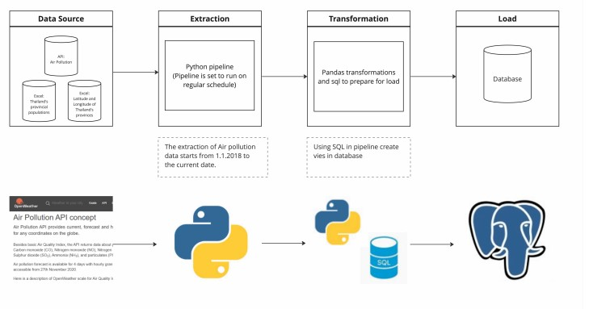
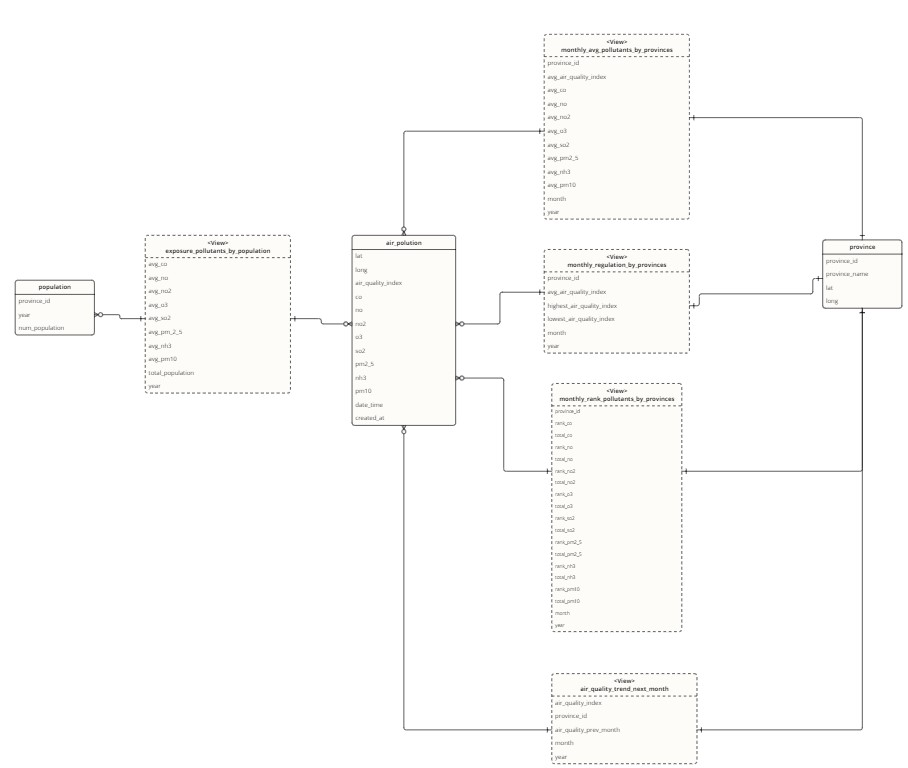

# debootcamp-project1

## Project Context and Goals

This project aims to create an automatic data pipeline solution that extract data from both live and static datasets, and load it to a relational database, which forms an analytical database with views for specific questions. The ELT process was applied to ensure an efficient and solid data transformation. 

This pipeline ensure an robust database source, that make analysts able to focus only on analytical questions and use indicators based on it.

## Business Objective

The objective of our project is to provide analytical datasets from our Air Pollution API , the csv of Thailand's provincial populations from 2012 to 2022 categorized by age group, and latitude and longitude of Thailand's provinces.csv

## Consumers

The users who will benefit from our datasets are data analyst who work for Thai public health official or local governments, and environmental researchers.

## Questions

There are two types of questions our data addresses: broad questions about current situation of air pollutants, and the analytical trend/stats of them.

Examples of these questions include but are not limited to:

- What are monthly averages of pollutants concentration (pm2.5, co) for each provinces in Thailand?
- Which month of the year has the highest/lowest air quality index in recent years for each provinces?
- Which provinces are in the need for air quality regulation from local governments or public health officials the most on monthly basis?
- What are the average exposure of Thai population to pollutants such as pm.2.5 or co from the year 2018 to 2020?
- How air quality trend will be for Thailand in next month?

Our data will allow our users to make decisions based on recent-year data.

## Source datasets

The live dataset is [Air Pollution API](https://openweathermap.org/api/air-pollution) which provides current, forecast and historical air pollution data for any coordinates on the globe.

Except for Air Pollution API, we used static datasets for [Thailand's provincial populations from 2012 to 2022 categorized by age group](http://statbbi.nso.go.th/staticreport/page/sector/en/01.aspx) to record populations and and [latitude and longitude of Thailand's provinces](https://data.go.th/dataset/item_c6d42e1b-3219-47e1-b6b7-dfe914f27910) to map province names. 

## Solution Architecture Diagram

Diagram below is the solution architecture:



- **Python** :
  - Extracting data from both live and static source.
  - Load data to postgres database.
  - Setting automatical refreshing.

- **PostgreSQL DBMS**:
  - Storing live and static data.

- **AWS RDS**:
  - Hosting and managing postgres database.

- **SQL**:
  - Creating views from loaded data tables.

- Others:
  - **Docker**: containerizzing our pipeline.
  - **ECR**: hosting our docker container.
  - **ECS**: running the docker container.
  - **S3**: stroing the `.env` file.
  
## ELT/ETL Techniques Applied

We use ELT to first load data into database then using sql to transform it, with ERD diagram shown as below:





## Limitations and Lessons Learned

Throughout the project, there are some learnings we would like to share:

- Since we come from different backgrounds, we assign tasks based on what each person is good at to finish on time. For example, someone skilled in SQL will handle database tasks. Then, we share our thought processes to keep everyone on the same page.
- learned that there is a retry method provided by the request library so there is no need to write a loop retrying.
- we have came across the issue of importing modules within the test files even if the modules contain the __init__.py  . So we need to have pytest.ini to set the desire PYTHONPATH environment.
- While setting up our database on RDS, we discovered the option to use AWS Secrets Manager to store the database user and password. We utilized Secrets Manager for securely storing our database credentials. Moreover, we can write code to retrieve this information from Secrets Manager make it easier to manage the credentials. We can also schedule password changes to further enhance security.

## Installation Instructions

### 1. Install PostgreSQL and Python

Download PostgreSQL and pgAdmin by going to <https://www.postgresql.org/download/> and selecting the installer for your Operating System. Download the latest version of PostgreSQL.


### 2. Clone Codes

Clone the github repository or manually download it.


### 3. Create .env file to store authentication information

Create an `.env` file in the main directory with the following format:

```py
# API key
API_KEY=<api key>

# DB information
LOGGING_SERVER_NAME = <postgresql db username>
LOGGING_DATABASE_NAME = <name of db>
LOGGING_USERNAME = <servername>
LOGGING_PASSWORD = <postgresql db password>
LOGGING_PORT = <port> 
```

### 4. Run pipeline

Once the previous steps are done, run the pipeline with python.

---

## AWS Screenshots

We use Docker to contain the pipeline, then load it into AWS ECR, and run on ECS.

### AWS ECS

Screenshot of task running:


Screenshot of logs:


### AWS ECR

Screenshot of image in ECR repository:


### AWS RDS

Screenshot of database in RDS:


### S3

Screenshot of `.env` file in S3:


